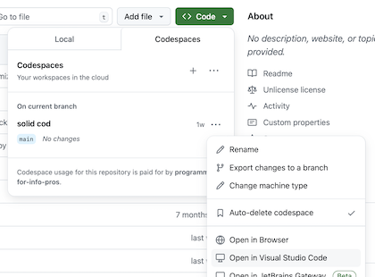
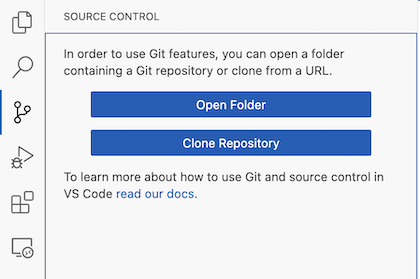
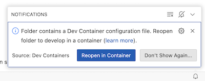

# Open the assignment

One of the purposes of this assignment is to introduce you to
different options for opening and working on assignment
repositories. (*[What's a repository?][repo]*)

You can choose to open this assignment repository:

* in a GitHub codespace (a [container][container] running on the
  [Microsoft Azure][azure] cloud platform). **This is the best option
  for most people.**
* in a Dev Container (a container running on your personal
  computer). To do this you will need to install both Visual Studio
  Code and Docker on your personal computer. **This is the best option
  if your personal computer is relatively new and fast, but your
  Internet connectivity is slow or intermittent.**

If you open the repository in a codespace, you can access the codespace:

* via your Web browser. **This is the best option if you want to avoid
  installing anything on your personal computer.**
* via Visual Studio Code installed on your personal computer. **This is
  the best option if you already have Visual Studio Code installed on
  your personal computer, or you would like to install it.**

[repo]: https://docs.github.com/en/get-started/learning-about-github/github-glossary#repository
[container]: https://en.wikipedia.org/wiki/Containerization_(computing)
[azure]: https://en.wikipedia.org/wiki/Microsoft_Azure

## Open the repository in a GitHub codespace via your browser

This option will create a copy of the repository in a GitHub codespace
running in the cloud and accessible via your web browser.

To open this repository in a codespace, click the green **<> Code**
button above. In the panel that opens, go to the **Codespaces** tab,
and click the **Create codespace on main** button.

## Open the repository in a GitHub codespace via Visual Studio Code

This option will create a copy of the repository in a GitHub codespace
running in the cloud and accessible via Visual Studio Code running on
your personal computer.

First, follow the instructions above for [opening the repository in a
GitHub codespace via your
browser](#open-the-repository-in-a-github-codespace-via-your-browser).

Then, click the green **<> Code** button above. In the panel that
opens, go to the **Codespaces** tab. You should see the codespace you
just created. It will have a randomly generated name like `solid
cod`. (If you do not see it, try refreshing the page.)

To open the codespace in Visual Studio code, click the **…** next to
the codespace and select **Open in Visual Studio Code**, and then
follow the prompts.

## Open the repository in a Dev Container via Visual Studio Code

This option will create a copy of the repository in a container
running on your personal computer, and open it in Visual Studio Code
also running on your personal computer.

If you choose this option, first make sure that you have [set up Git
in VS Code][setup] and have signed into VS Code with your GitHub
account. Then, follow the instructions to [clone a repository
locally][local]. (“[Clone][clone]” means “copy.”)

You should see a repository named `<your-github-username>/hello-world`
in the list of repositories available to clone. (Make sure you do not
accidentally clone the `sils-webinfo/hello-world` repository.)

Once you’ve selected the repository to clone, you’ll be prompted to
pick a local folder on your computer as the destination of your
repository. If (for example) you pick a folder named `Code`, then
cloning the `<your-github-username>/hello-world` repository will
create a folder named `hello-world` inside the `Code` folder.

Next you'll be asked if you trust the authors of the code, which
you should.

At some point, a notification should pop up in the lower right corner
asking if you want to reopen the folder in a container. You should do
this.

If you miss the notification, click the bell icon in the lower right
corner to show it again.

[clone]: https://docs.github.com/en/get-started/learning-about-github/github-glossary#clone
[setup]: https://code.visualstudio.com/docs/sourcecontrol/intro-to-git#_set-up-git-in-vs-code
[local]: https://code.visualstudio.com/docs/sourcecontrol/intro-to-git#_clone-a-repository-locally

<!-- Local Variables: -->
<!-- jinx-local-words: "Codespaces Dev codespace" -->
<!-- End: -->
